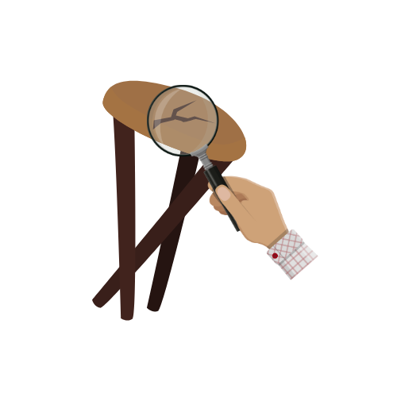
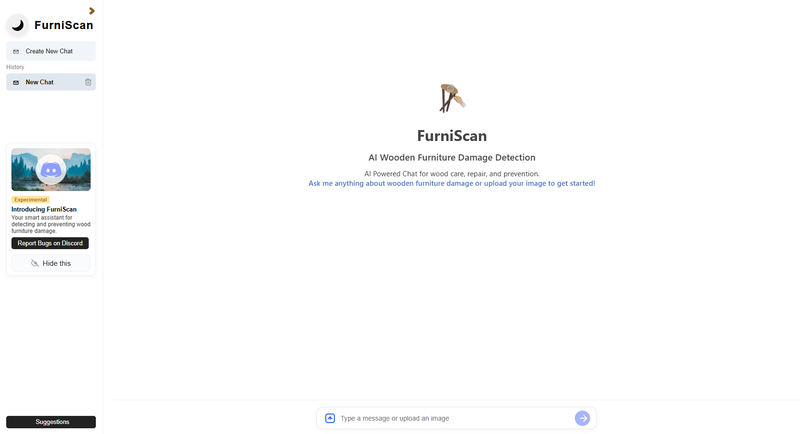
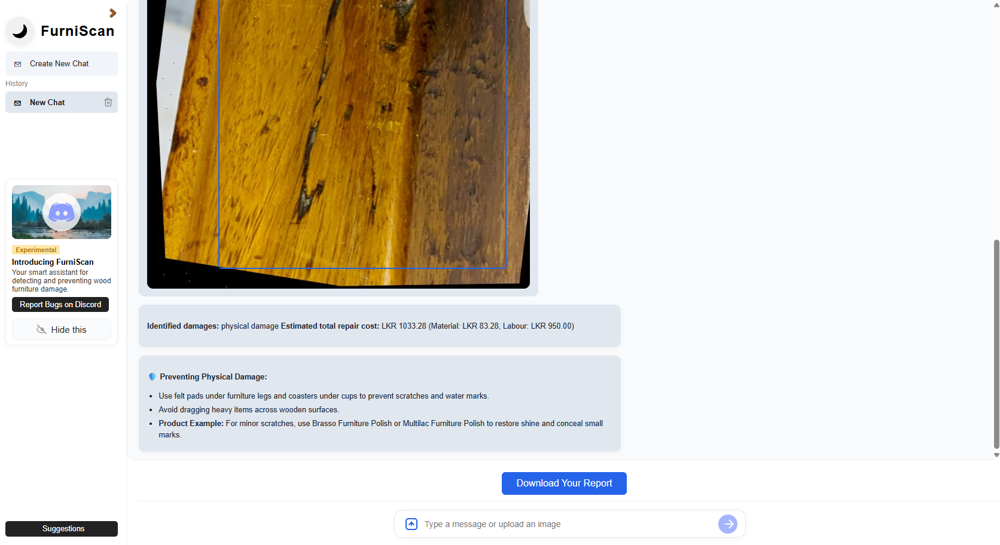
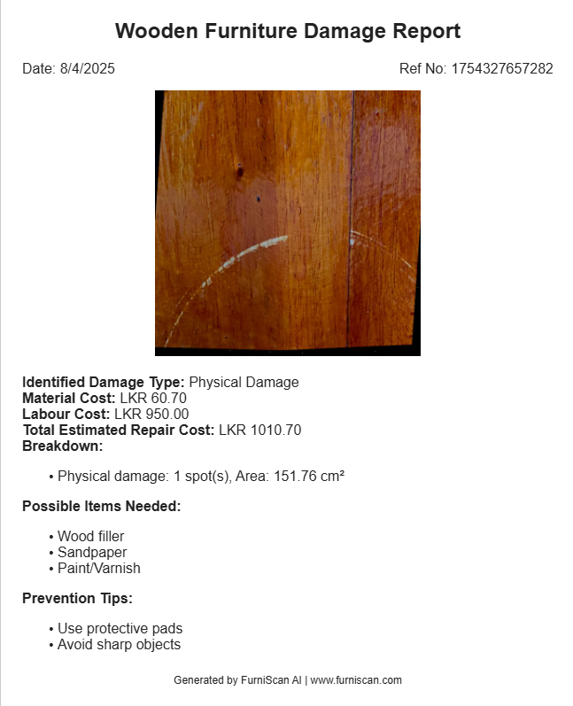
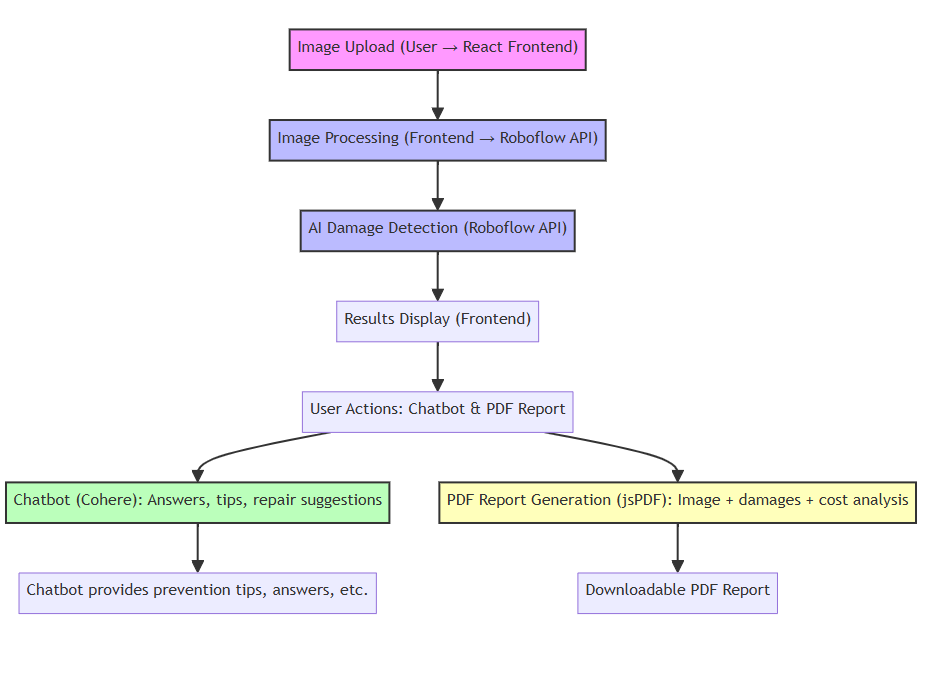

<p align="center">
  
</p>

<h1 align="center">🪑 FurniScan AI</h1>
<p align="center">
  <b>AI-powered Wooden Furniture Damage Detection & Reporting</b><br>
  <i>Scan, detect, and report wooden furniture damages in seconds!</i>
</p>

<p align="center">
  <a href="https://furni-scan-ai.vercel.app/"></a>
  <a href="https://github.com/POORNA-github/FurniScanAI"></a>
  <a href="https://github.com/POORNA-github/FurniScanAI/issues"></a>
  
</p>

---

## 🚀 Technologies Used

<p align="center">
  
  
  
  
  
  
  
  
</p>

---

## 🚀 Overview

**FurniScan AI** is a next-generation web application that leverages the power of artificial intelligence to detect and report damages in wooden furniture from images. The platform combines a robust React frontend, advanced AI models, and seamless cloud deployment to deliver instant, actionable insights for manufacturers, sellers, and homeowners.

### 🧠 How It Works

1. **Image Upload:** Users upload a photo of their wooden furniture through a modern, drag-and-drop interface built with React and TypeScript.
2. **AI Damage Detection:** The uploaded image is analyzed using the [Roboflow](https://roboflow.com/) `rfdetr-nano` model—a fast, lightweight, and highly accurate object detection model optimized for real-time inference. This model identifies and localizes various types of wooden damage (such as cracks, scratches, and dents) directly in the image.
3. **Results Visualization:** Detected damages are displayed on an interactive canvas with bounding boxes and labels, allowing users to visually inspect the findings.
4. **Cost Analysis & Reporting:** The app calculates repair costs based on customizable material and labor rates, and generates a professional PDF report using jsPDF.
5. **Conversational AI Support:** Users can interact with an AI-powered chatbot (powered by [Cohere](https://cohere.com/)) for instant answers, prevention tips, and further guidance.
6. **Cloud Deployment:** The entire application is deployed on [Vercel](https://vercel.com/) for fast, reliable, and scalable access from any device.

### 🛠️ Technologies Explained

- **React & TypeScript:** Provide a robust, type-safe, and scalable frontend architecture for building interactive UIs.
- **Tailwind CSS & CSS Variables:** Enable rapid, utility-first styling and dynamic theming for a modern, responsive design.
- **Roboflow rfdetr-nano Model:** A state-of-the-art, lightweight object detection model trained specifically for wooden damage detection. It offers a balance of speed and accuracy, making it ideal for real-time web applications.
- **Cohere Chatbot:** Integrates advanced natural language processing to deliver a conversational assistant that can answer questions, provide prevention guidelines, and enhance user engagement.
- **jsPDF:** Allows users to export detailed, visually rich PDF reports of detected damages and cost breakdowns.
- **Vercel:** Handles seamless cloud deployment, ensuring the app is always available, fast, and secure.

FurniScan AI brings together the latest in AI, web development, and user experience to make furniture damage assessment effortless, accurate, and accessible to everyone.

---

## 🧩 Key Components

| Component                | Purpose / Description                                 | Features                                      |
|--------------------------|------------------------------------------------------|-----------------------------------------------|
| `App`                    | Main application entry point                         | Routing, global state, layout                 |
| `ImageUploader`          | Upload and preview furniture images                  | Drag & drop, file validation, preview         |
| `DamageDetector`         | AI-powered damage detection logic                    | Calls Roboflow API, processes results         |
| `AnalysisCanvas`         | Visualizes detected damages on images                | Bounding boxes, zoom, pan                     |
| `ResultsPanel`           | Displays detection results and cost breakdown        | Material/labor cost, export to PDF            |
| `SettingsDialog`         | User configuration for costs and preferences         | Editable rates, persistent settings           |
| `ChatAssistant`          | AI-powered chatbot for user support                  | Cohere integration, prevention tips           |
| `HistoryViewer`          | Shows previous scans and reports                     | List, view, delete, export                    |
| `PDFExporter`            | Generates downloadable PDF reports                   | Customizable, includes images and results     |
| `Sidebar`                | Navigation and quick actions                         | New scan, history, settings                   |

---

## 🎨 Styling System

| Feature                | Description                                         |
|------------------------|-----------------------------------------------------|
| **CSS Variables**      | Dynamic theming support for easy color and style changes |
| **Tailwind CSS**       | Utility-first styling for rapid UI development      |
| **Responsive Design**  | Mobile-first approach for seamless experience across devices |
| **Modern Gradients**   | Professional visual appeal with smooth color transitions |
| **Accessibility**      | WCAG 2.1 AA compliant for inclusive user experience |

---

## 🛠️ Tech Stack

- **Frontend:** React, TypeScript
- **Styling:** Tailwind CSS, CSS Variables
- **AI Model:** Roboflow API (rfdetr-nano for damage detection)
- **Chatbot:** Cohere (AI-powered conversational assistant)
- **PDF Generation:** jsPDF
- **Deployment:** Vercel

---

## 🖼️ Screenshots

<p align="center">
  
  <br>
  <em>Homepage - Upload and scan your furniture instantly</em>
</p>

<p align="center">
  
  <br>
  <em>AI-powered damage detection with bounding boxes</em>
</p>

<p align="center">
  
  <br>
  <em>Downloadable PDF damage report</em>
</p>

---

## 🗺️ System Diagram

<p align="center">
  
  <br>
  <em>Diagram - How System Works</em>
</p>

## 🤝 Contributing

We love contributions! Here’s how you can help make this project even better:

### 🌟 Ways to Contribute

- 🐛 **Bug Reports:** Found an issue? [Open a bug report](https://github.com/POORNA-github/FurniScanAI/issues)
- ✨ **Feature Requests:** Have an idea? [Suggest a feature](https://github.com/POORNA-github/FurniScanAI/issues)
- 📖 **Documentation:** Improve docs, add examples, fix typos
- 🎨 **UI/UX:** Enhance design, improve accessibility
- 🧠 **AI Models:** Help improve detection accuracy
- 🌍 **Translations:** Add support for more languages

---

### 🚀 Development Process

1. 🍴 **Fork the Repository**

    ```bash
    git clone https://github.com/POORNA-github/FurniScanAI.git
    ```

2. 🌿 **Create a Feature Branch**

    ```bash
    git checkout -b feature/amazing-new-feature
    ```

3. 💻 **Make Your Changes**
    - Follow the existing code style
    - Add tests if applicable
    - Update documentation

4. ✅ **Test Your Changes**

    ```bash
    npm start      # Test locally
    npm run build  # Verify production build
    npm run lint   # Check code quality
    ```

5. 📝 **Commit Your Changes**

    ```bash
    git commit -m "✨ Add amazing new feature"
    ```

6. 🚀 **Push and Create PR**

    ```bash
    git push origin feature/amazing-new-feature
    ```
    - Open a Pull Request on GitHub

---

### 📋 Development Guidelines

- **Code Style:** Follow existing patterns and ESLint rules
- **Commits:** Use [conventional commit messages](https://www.conventionalcommits.org/)
- **Documentation:** Update README and inline docs
- **Testing:** Verify functionality before submitting

---

## 🏆 Developers

[](https://github.com/POORNA-github/FurniScanAI/graphs/contributors)

- [POORNA-github](https://github.com/POORNA-github)
- [Disira](https://github.com/Disira)

## 🙏 Acknowledgements

- [Roboflow](https://roboflow.com/) for the AI detection API  
- [Cohere](https://cohere.com/) for the conversational AI  
- [React](https://reactjs.org/)  
- [Vercel](https://vercel.com/)  
- All contributors and users!
